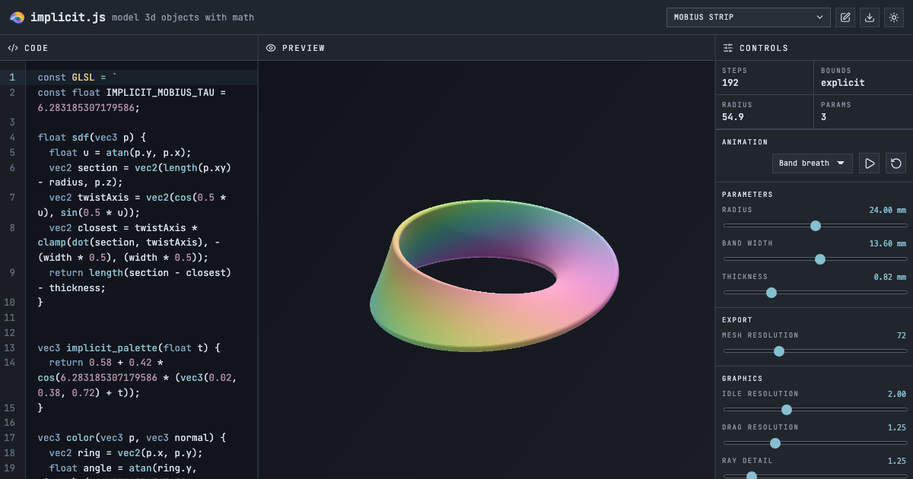

# implicit.js

[Package](package) | [Model format](docs/model-format.md) | [API](docs/api.md) | [CLI](docs/cli.md) | [@earthtojake](https://x.com/earthtojake)


Browser-native implicit CAD for JavaScript apps.

implicit.js turns small `.implicit.js` model files into interactive WebGL
previews, screenshots, GIFs, and exportable meshes. Bring your own editor,
catalog, storage, and product flow; implicit.js handles the model runtime,
shader renderer, SDF sampling, snapshots, and STL/3MF/GLB exports.

## Why

Implicit CAD is a nice fit for parametric parts, mathematical surfaces,
agent-generated geometry, procedural art, lattices, and browser tools that need
real 3D output without a heavyweight CAD kernel.

With implicit.js, a model is just an ES module with a signed distance function:

```js
export default {
  schema: "implicit.js/0.1.0",
  name: "rounded orb",
  units: "mm",
  params: {
    radius: { type: "number", min: 8, max: 50, default: 24, unit: "mm" }
  },
  bounds: ({ params }) => params.radius + 4,
  glsl: `
float sdf(vec3 p) {
  return implicit_sphere(p, vec3(0.0), radius);
}
`
};
```

## What You Get

- Load `.implicit.js` and `.implicit.mjs` modules in modern ESM runtimes.
- Render models with Three.js and WebGL raymarching.
- Expose number, boolean, color, enum, string, and button parameters.
- Generate PNG snapshots and orbit/animation GIFs in a headless browser.
- Sample meshes from SDFs and export STL, 3MF, and GLB files.
- Export animated GLB files from model animation definitions.
- Analyze generated mesh quality before handing files to another tool.

## Install

```bash
npm install implicitjs
```

The package is UI-framework agnostic. It works well inside React, plain browser
apps, local agent tools, and Node-based export pipelines.

## Demo App

The `app/` folder contains a small Vite playground with a code editor, live
preview, parameter controls, examples, snapshots, and exports. It is a demo of
the package, not a required part of the runtime.

```bash
cd app
npm install
npm run dev
```

Open the local URL Vite prints.

## Reference

| Doc | What it covers |
| --- | --- |
| [Model format](docs/model-format.md) | The `.implicit.js` schema, parameters, bounds, GLSL, color, render settings, and animations. |
| [API](docs/api.md) | Public imports for loading, rendering, snapshots, mesh sampling, exports, and quality checks. |
| [CLI](docs/cli.md) | Snapshot and export commands for local files and render jobs. |
| [Development](docs/development.md) | Repository layout, local commands, and contribution notes. |

## License

MIT. See [LICENSE](LICENSE).
